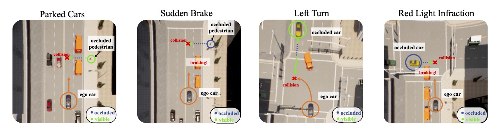

# DOS: A driving simulation benchmark DriveOcclusionSim consisting of diverse occlusion events

> [Hao Shao](http://hao-shao.com/), [Letian Wang](https://letianwang0.wixsite.com/myhome), RuoBing Chen, [Steven L. Waslander](https://www.trailab.utias.utoronto.ca/), [Hongsheng Li](http://www.ee.cuhk.edu.hk/~hsli/), [Yu Liu](https://liuyu.us/)
> 
> [CVPR 2023](https://arxiv.org/abs/2305.10507)


This repository contains the benchmark proposed by the paper [ReasonNet: End-to-End Driving with Temporal and Global Reasoning
](https://arxiv.org/abs/2305.10507). 

This is a CARLA based framework providing diverse driving scenarios with occluded objects. The proposed DOS benchmark includes four types of challenging occlusion driving scenarios. Each of the four scenarios in the DOS benchmark comprises 25 different cases varying in the road environment and background traffic:
1. **Parked Cars**: The ego vehicle is driving in a straight lane with parked cars on the side. Pedestrians can first appear on the sidewalk (visible) and then suddenly emerge through the occluded areas between parked cars (occluded).
2. **Sudden Brake**: The ego vehicle is driving in a straight lane along with other vehicles ahead. Pedestrians can suddenly emerge from the sidewalks, causing the other vehicles to brake while remaining invisible to the ego vehicle.
3. **Left Turn**: The ego vehicle intends to perform an unprotected left turn at an intersection, but a truck in the opposite lane blocks the view of oncoming traffic, intermittently obscuring vehicles driving straight through the intersection.
4. **Red Light Infraction**: The ego vehicle is crossing an intersection after some trucks. A left-to-right vehicle running a red light suddenly appears, forcing the trucks to brake promptly. But the ego vehicle’s view toward the running-light vehicle is blocked by the trucks, so it remains invisible to the ego vehicle.

Compared to a previous occlusion benchmark [AUTOCASTSIM](https://github.com/hangqiu/AutoCastSim), the DOS benchmark: 1) includes occlusions of both vehicles and pedestrians, instead of only vehicles; 2) includes 100 cases of 4 scenarios, instead of only 3 cases of 3 scenarios; 3) considers specific occlusions that can potentially be resolved by temporal reasoning (intermittent occlusion, #1, #3) and global reasoning (constant occlusion but with interaction clues, #2, #4) about the scene, instead of random occlusions as in AUTOCASTSIM. Thus our scenarios can also serve as a good tracking-with-intermittent-occlusion benchmark and a People-as-Sensor benchmark.

## Setup
If you want to use this benchmark to collect data or eval your agents, only four steps you need to do:
1. Git clone the repo
2. Go to the directory and backup your `leaderboard` and `scenario_runner`
3. Replace the `leaderboard` and `scenario_runner` directory with the files provided in this repo
4. Modify `leaderboard/scripts/run_evaluation.sh`, let `ROUTES` = `DOS_benchmark/DOS_0X_town05.xml`, `SCENARIOS` = `DOS_benchmark/DOS_0X_town05.json`. X is the scenario id (from 1 to 4)


## Demo videos

Parked Cars(#1):

https://github.com/opendilab/DOS/assets/17512647/15ce30b5-f165-44d2-abe8-f1a8e368399d


Sudden Brak(#2):

https://github.com/opendilab/DOS/assets/17512647/2d0c8f59-a680-4f43-ad50-fecea862b62d


Left Turn(#3):

https://github.com/opendilab/DOS/assets/17512647/ee10bec5-136a-4d29-9fea-34b2e426c5bf


Red Light Infraction(#4):

https://github.com/opendilab/DOS/assets/17512647/dd848eb6-c9a4-4d63-be70-1423dbc880b3


## Acknowledgements
This implementation is based on code from several repositories.
- [2020_CARLA_challenge](https://github.com/bradyz/2020_CARLA_challenge)
- [CARLA Leaderboard](https://github.com/carla-simulator/leaderboard)
- [Scenario Runner](https://github.com/carla-simulator/scenario_runner)

## Citation
If you find our repo or paper useful, please cite us as
```bibtex
@inproceedings{shao2023reasonnet,
  title={ReasonNet: End-to-End Driving with Temporal and Global Reasoning},
  author={Shao, Hao and Wang, Letian and Chen, Ruobing and Waslander, Steven L and Li, Hongsheng and Liu, Yu},
  booktitle={Proceedings of the IEEE/CVF Conference on Computer Vision and Pattern Recognition},
  pages={13723--13733},
  year={2023}
}
```

## License
All code within this repository is under [Apache License 2.0](https://www.apache.org/licenses/LICENSE-2.0).
